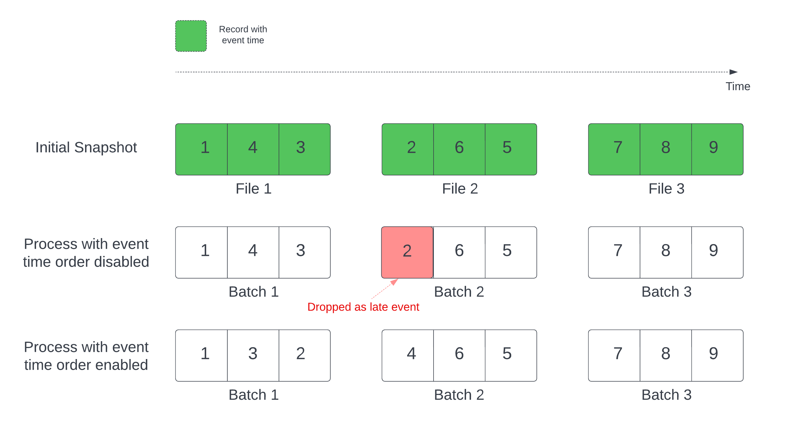

Delta Lake is deeply integrated with [Spark Structured Streaming](https://spark.apache.org/docs/latest/structured-streaming-programming-guide.html) through `readStream` and `writeStream`. Delta Lake overcomes many of the limitations typically associated with streaming systems and files, including:

- Maintaining “exactly-once” processing with more than one stream (or concurrent batch jobs)

- Efficiently discovering which files are new when using files as the source for a stream

For many Delta Lake operations on tables, you enable integration with Apache Spark DataSourceV2 and Catalog APIs (since 3.0) by setting configurations when you create a new SparkSession. See Configure SparkSession.

When you load a Delta table as a stream source and use it in a streaming query, the query processes all of the data present in the table as well as any new data that arrives after the stream is started.

## Basic Streaming Read Examples

### Scala

```scala
spark.readStream.format("delta")
  .load("/tmp/delta/events")

import io.delta.implicits._
spark.readStream.delta("/tmp/delta/events")
```

## In This Section

- [Limit Input Rate](#limit-input-rate)
- [Ignore Updates and Deletes](#ignore-updates-and-deletes)
- [Specify Initial Position](#specify-initial-position)
- [Process Initial Snapshot Without Data Being Dropped](#process-initial-snapshot-without-data-being-dropped)
- [Tracking Non-Additive Schema Changes](#tracking-non-additive-schema-changes)

## Limit Input Rate

The following options are available to control micro-batches:

- `maxFilesPerTrigger`: How many new files to be considered in every micro-batch. The default is 1000.
- `maxBytesPerTrigger`: How much data gets processed in each micro-batch. This option sets a "soft max", meaning that a batch processes approximately this amount of data and may process more than the limit in order to make the streaming query move forward in cases when the smallest input unit is larger than this limit. If you use `Trigger.Once` for your streaming, this option is ignored.

If you use `maxBytesPerTrigger` in conjunction with `maxFilesPerTrigger`, the micro-batch processes data until either the `maxFilesPerTrigger` or `maxBytesPerTrigger` limit is reached.

> **Note**: In cases when the source table transactions are cleaned up due to the `logRetentionDuration` configuration and the stream lags in processing, Delta Lake processes the data corresponding to the latest available transaction history of the source table but does not fail the stream. This can result in data being dropped.

## Ignore Updates and Deletes

Structured Streaming does not handle input that is not an append and throws an exception if any modifications occur on the table being used as a source. There are two main strategies for dealing with changes that cannot be automatically propagated downstream:

- You can delete the output and checkpoint and restart the stream from the beginning.
- You can set either of these two options:
  - `ignoreDeletes`: ignore transactions that delete data at partition boundaries.
  - `ignoreChanges`: re-process updates if files had to be rewritten in the source table due to data changing operations such as `UPDATE`, `MERGE INTO`, `DELETE` (within partitions), or `OVERWRITE`. Unchanged rows may still be emitted, therefore your downstream consumers should be able to handle duplicates. Deletes are not propagated downstream. `ignoreChanges` subsumes `ignoreDeletes`.

### Example

For example, suppose you have a table `user_events` with `date`, `user_email`, and `action` columns that is partitioned by `date`. You stream out of the `user_events` table and you need to delete data from it due to GDPR.

When you delete at partition boundaries (that is, the `WHERE`is on a partition column), the files are already segmented by value so the delete just drops those files from the metadata. Thus, if you just want to delete data from some partitions, you can use:

For deleting at partition boundaries:

```scala
spark.readStream.format("delta")
  .option("ignoreDeletes", "true")
  .load("/tmp/delta/user_events")
```

For deleting based on non-partition columns:

```scala
spark.readStream.format("delta")
  .option("ignoreChanges", "true")
  .load("/tmp/delta/user_events")
```

If you update a `user_email` with the `UPDATE` statement, the file containing the `user_email` in question is rewritten. When you use `ignoreChanges`, the new record is propagated downstream with all other unchanged records that were in the same file. Your logic should be able to handle these incoming duplicate records.

## Specify Initial Position

You can use the following options to specify the starting point of the Delta Lake streaming source without processing the entire table:

- `startingVersion`: The Delta Lake version to start from (inclusive).
- `startingTimestamp`: The timestamp to start from (inclusive), which can be:
  - A timestamp string (e.g., "2019-01-01T00:00:00.000Z")
  - A date string (e.g., "2019-01-01")

You cannot set both options simultaneously. They only take effect when starting a new streaming query.

> **Important**: The schema of the streaming source is always the latest schema of the Delta table. Ensure there are no incompatible schema changes.

### Example

```scala
// Start from version 5
spark.readStream.format("delta")
  .option("startingVersion", "5")
  .load("/tmp/delta/user_events")

// Start from a specific date
spark.readStream.format("delta")
  .option("startingTimestamp", "2018-10-18")
  .load("/tmp/delta/user_events")
```

## Process Initial Snapshot Without Data Being Dropped

When using a Delta table as a stream source, the initial snapshot processing can potentially drop records due to modification time ordering.

You can avoid this by enabling:

- `withEventTimeOrder`: Processes the initial snapshot with event time order

With event time order enabled, the event time range of initial snapshot data is divided into time buckets. Each micro batch processes a bucket by filtering data within the time range. The `maxFilesPerTrigger` and `maxBytesPerTrigger` configuration options are still applicable to control the microbatch size but only in an approximate way due to the nature of the processing.

The graphic below shows this process:



Notable information about this feature:

- The data drop issue only happens when the initial Delta snapshot of a stateful streaming query is processed in the default order.

- You cannot change `withEventTimeOrder` once the stream query is started while the initial snapshot is still being processed. To restart with withEventTimeOrder changed, you need to delete the checkpoint.

- If you are running a stream query with withEventTimeOrder enabled, you cannot downgrade it to a Delta version which doesn’t support this feature until the initial snapshot processing is completed. If you need to downgrade, you can wait for the initial snapshot to finish, or delete the checkpoint and restart the query.

- This feature is not supported in the following uncommon scenarios:

  - The event time column is a generated column and there are non-projection transformations between the Delta source and watermark.
  - There is a watermark that has more than one Delta source in the stream query.

- With event time order enabled, the performance of the Delta initial snapshot processing might be slower.

- Each micro batch scans the initial snapshot to filter data within the corresponding event time range. For faster filter action, it is advised to use a Delta source column as the event time so that data skipping can be applied (check \_ for when it’s applicable). Additionally, table partitioning along the event time column can further speed the processing. You can check Spark UI to see how many delta files are scanned for a specific micro batch.

### Example

```scala
spark.readStream.format("delta")
  .option("withEventTimeOrder", "true")
  .load("/tmp/delta/user_events")
  .withWatermark("event_time", "10 seconds")
```

## Tracking Non-Additive Schema Changes

You can provide a `schemaTrackingLocation` to enable streaming from Delta tables with column mapping, allowing streams to read past table data in their exact schema.

### Example

```python
checkpoint_path = "/path/to/checkpointLocation"

(spark.readStream
  .option("schemaTrackingLocation", checkpoint_path)
  .table("delta_source_table")
  .writeStream
  .option("checkpointLocation", checkpoint_path)
  .toTable("output_table")
)
```

> **Note**: For streaming workloads with multiple source Delta tables, specify unique directories within the `checkpointLocation` for each source table.
